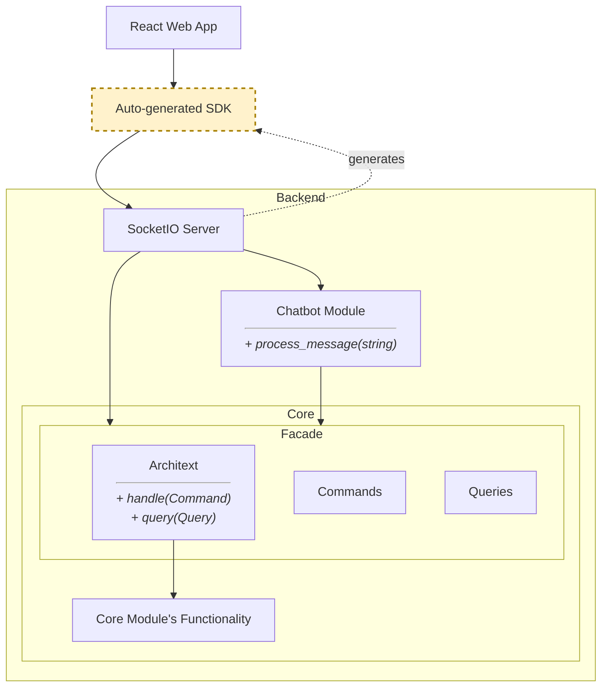
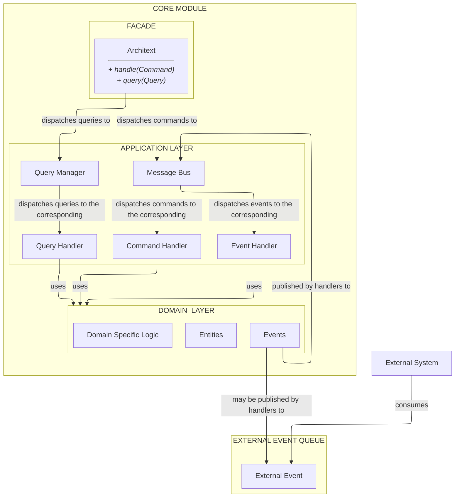
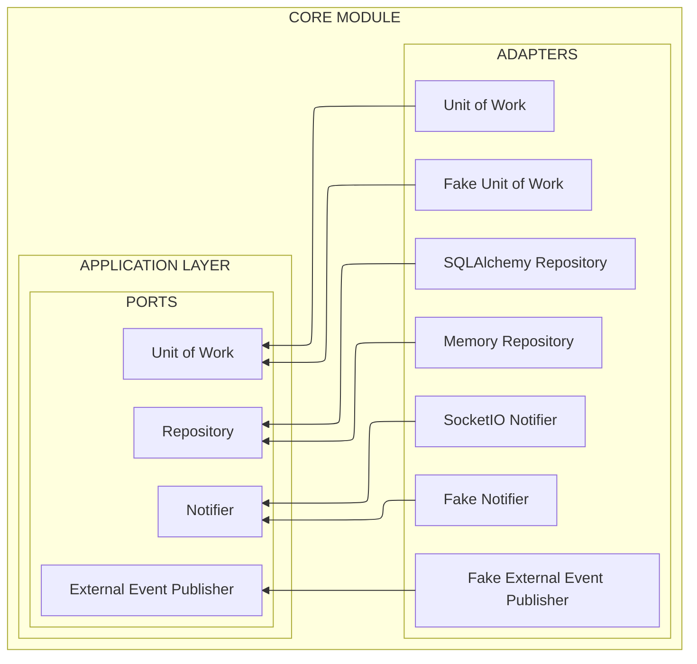
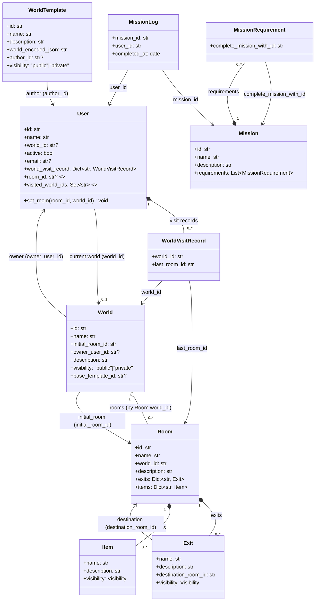

### [Play now on archi-text.com](https://archi-text.com)


# Table of contents
- [Overview](#overview)
- [How to play](#how-to-play)
- [System Overview](#system-overview)
  - [Core Module](#core-module)
    - [Commands](#commands)
    - [Queries](#queries)
    - [External Dependencies](#external-dependencies)
    - [Domain](#domain)
      - [Entities](#entities)
      - [Events](#events)
      - [Domain-specific logic](#domain-specific-logic-aka-services)
  - [Chatbot module](#chatbot-module)
  - [Entrypoints](#entrypoints)
    - [SocketIO entrypoint](#socketio-entrypoint)
  - [How can we scale?](#how-can-we-scale)
- [Methodology](#methodology)

# Overview
**Architext** is a multiplayer *virtual reality* text game that allows you to explore **and create** worlds entirely made of words (pun intended). And because of the huge expressive power of words, there is no limit to what you can build.

## Features
* Enter and explore worlds made by other players.
* Freely build your own worlds using a simple set of commands.
* Share your worlds or play them privately with your friends.
* Talk and interact with other connected players.
* Export your worlds as a backup or to share them online.

As a creator, Architext allows you to take a physical place from your imagination to a reality where you can share it with anyone. It's also great to build puzzle/escape room games and to create a setting to run role-playing games in.

# How to play

Go to http://archi-text.com and play the five-minute tutorial :-)

Then you can play The Monk's Riddle, an escape room–type game that is a bit more challenging and shows what you can do with the tools at your disposal.

# System Overview

> In this overview I try to cover most of the important parts of the system as well as architecture decisions. But be aware that it is not complete and will become outdated, since I won't be updating it with every change. It should make you understand the system as a whole though.
>
> Also, I try to define some things along the way, since different people use the same words with different meanings. Let me know if you find any ambiguity.

At its core, Architext is a monolithic app written with simplicity and flexibility in mind. I refrain from optimizing prematurely, while maintaining an architecture that will let me do so when needed.

- The ``Core`` module is the heart of the app. It is a _Command and Query_-driven module that handles all business logic, queries and use cases, while exposing a thin facade.
- The ``Chatbot`` module handles text messages sent by players, including interactive multiple-step commands. It is just a layer on top of the Core module, and calls on its functionality when needed.
- Both the ``Core`` and ``Chatbot`` modules are directly used by a thin SocketIO server that contains no logic other than session management and authentication.
- The web app uses an SDK that is auto-generated by a custom solution (see [py-writes-ts repository](https://github.com/oliver-ni/py-writes-ts)) to communicate with the server, ensuring end-to-end type safety.



# Core Module

Let's now discuss the inner workings of the ``Core`` module. The next diagram is a little more involved, but I will explain it in detail.




## Commands

Let's start with command handling. ``Command``s are Python data-only objects that describe the intent of the user to modify the state of the system. The facade forwards ``Command``s to the ``Message Bus`` which calls the appropriate handler.

The command handler will mutate the state of the domain entities, and may trigger ``Event``s. ``Event``s are data-only objects that describe something that happened in the system.

Those ``Event``s are published to the message bus, which will call all the event handlers subscribed to that event.

``Command`` and ``Event`` handlers can also publish ``Event``s to an external event queue, opening the door to segregate certain functionality from the main monolith as needed.

``Command``s must not contain references to any entity from the domain model. Entities must not be leaked outside of the ``Core`` module. The same applies to the results returned to the client code.

> ### Reasoning
> Reasons why I chose this Event Driven approach:
> - Makes it easy to respect the single responsibility principle in the command handlers. Any side effects of an action that are not part of the main use case (like sending notifications to interested parties) should be handled by the event handlers.
> - The system also benefits from better error resiliency by default. The notification system may fail, but the command handler will still be able to do its job.
> - Events and Commands create a unified language to communicate between the different layers of the system.

## Queries

Queries are data-only objects that describe the intent of the user to query the state of the system. The facade forwards queries to the ``Message Bus`` which calls the appropriate handler, and then returns the query result.

``Queries`` must not contain references to any entity from the domain model. Entities must not be leaked outside of the ``Core`` module. The same applies to the results returned to the client code.

## External Dependencies

The ``Core`` module needs to drive some external systems to have an impact on the outside world:
- Store and retrieve data, aka a ``Repository``.
- Send notifications to users, aka a ``Notifier``.
- Publish events to external systems, aka an ``External Event Publisher``.
- Handle transactions and roll back changes in case of failure, aka a ``Unit of Work``. 

Let's see how that is solved in the ``Core`` module.



I have adopted a Ports & Adapters architecture. The ``Application`` layer defines each of its 
dependencies as an interface that we call ``Port``. Then, instead of directly importing and using
the needed library or tool, the ``Application`` code expects to be initialized with objects that
match those ``Port`` interfaces, and then use them as needed.

This way the ``Application`` layer does not depend on those specific implementations. All it knows
are the interfaces defined by itself.

Then, we create the specific implementation for each ``Port``, which are named ``Adapter``s.

For each ``Port`` we have created two kinds of ``Adapter``s:
- ``Fake`` adapters, that are used for testing purposes and do not depend on any external
infrastructure.
- ``Real`` adapters, that are used in production.

For example, the ``Notifier`` port has the following implementations:
- ``Fake Notifier``, which just saves the notifications for later inspection.
- ``SocketIO Notifier``, which sends the notifications as events to a SocketIO server.
- ``Chatbot Notifier``, which lets the ``Core`` module drive the ``Chatbot`` module to notify users through a message in the chat.
- ``Multi Notifier``, which lets you build a composed notifier, using a different implementation for each type of notification.

### Dependency injection

Dependencies are injected into the ``Core`` module by its facade. The ``Architext`` class expects a ``Unit of Work`` in its constructor, which contains all the dependencies needed by the ``Core`` module.

The ``Unit of Work`` is a special ``Port``, because it is used to contain a reference to all other ``Port``s to be used by the application code. This is done simply to simplify dependency passing throughout the system.

> ### Optimizing Queries
> By default, all data access is done using the ``Repository`` interface. This poses a challenge as some complex queries may need to be written in raw SQL to optimize performance. To solve this we can substitute any query handler by an alternative one that uses a raw SQL query. We should do this sparingly, since it couples the query to the database, which will add maintenance overhead.

> ### Reasoning
>
> This architectural decision has some benefits:
> - It allows us to defer implementation of the adapters until we already have much more information
to make the right decisions.
> - It allows us to change technologies, even using different ones for different parts of the system,
without significant changes in the existing codebase.
> - It encapsulates the implementation of the adapters, preventing it from being scattered around the codebase,
and making it easier to change.
> - It allows us to test all functionality without depending on external systems or mocks.
>
> For example:
> - Most of the functionality was first written without a database using only the memory ``Repository``,
speeding up development and testing. Then, connecting the system to a SQL database was done in one coding session 
without touching the existing code.
> - The test suite runs in 40 seconds using a SQLite database, 2.5 seconds using the memory ``Repository``, which is useful for continuous testing during development.
> - Testing the notification logic is straightforward, without the need for any mocks.
> - At the moment, the ``External Event Publisher`` is not yet implemented. The fake implementation
just forwards messages to the ``Message Bus``. Even without its implementation, all functionality is
working. Also, we can test a flow that may include different services in a simple test without
mocking or setting up any infrastructure.

## Domain

The ``Domain`` layer defines:
- Entities
- Events
- Domain-specific logic (some call it _Services_)

### Entities

The goal of the system is to maintain a set of entities in a consistent state, mutate them according to a set of operations (commands) and look at them to get information (queries).

Entities are the "things" that the system is about. Each entity contains the data and logic relevant to that thing. 

Entities are part of the ``Core`` module inner workings, and should not be leaked outside of it. That coupling may cause problems in the future, making it harder to change the domain model, or even worse, making it change because of some change in the modules that depend on it.

The entities are bundled in aggregates. An aggregate is a group of entities that are related to each other and that do not make sense nor can be identified on their own.

In each kind of aggregate one entity is designated as the _root_. This is the only entity that any entity outside of the aggregate can hold a direct reference to, and it should do it through an ID. Entities within the aggregate reference each other using a direct reference. An entity's methods should not use any other entity as a reference, except for the root, which can use any other entity inside the aggregate.

This kind of organization makes it easier to persist entities and avoid inconsistencies due to race conditions. Aggregates should be read and modified together, and all their entities can be locked together for each transaction.

In the following diagram, filled diamonds connect entities that are part of the same aggregate with the root entity.

Choosing whether to put entities inside the same aggregate is a decision that should take into account many factors, such as the read and write access patterns, the number of entities, and the complexity and size of the aggregate.

> This diagram could get outdated, but still should give you an idea of how the entities are organized.



## Events

Events are data-only objects that describe something that happened in the system. Let's see an example:

```python
@dataclass
class UserChangedRoom(Event):
    user_id: str
    method: Literal["used_exit", "teleported", "changed_world"]
    room_entered_id: Optional[str] = None
    room_left_id: Optional[str] = None
    exit_used_name: Optional[str] = None
```

This event is published by multiple command handlers when a user moves from one room to another, enters, or leaves a world.

This event is consumed by handlers that, for example, notify users when another enters or leaves the room they are in.

Events _could_ contain references to entities, but they should not, since an event may be published to the external event queue and consumed by other systems. Entities should never be leaked outside of the ``Core`` module.

> Thanks to events, we just write the notification logic once and raise the event whenever a user changes room. This way we avoid the need to maintain the same notification logic in each command handler.

# Domain-specific logic (aka Services)

Apart from Entities and Events, the ``Domain`` layer contains other domain-specific logic. This includes:
- Operations that use more than one aggregate.
- Logic that does not use any domain entity or logic shared by multiple entities and/or the application layer, such as the rules that govern how items and exits are searched for from a user-provided incomplete name.

# Chatbot module

> Most of the organization of this module comes from the legacy first version of Architext, where everything was handled in the chatbot module (and before I studied the software architecture concepts I like to apply nowadays).

The Chatbot module uses some concepts also applied in the Core module but not all of them, since this is a smaller and far less critical part of the system, with different requirements.

- We still have Ports & Adapters to keep the functionality isolated from infrastructure.
- We don't use repositories as the module does not need to persist any data.
- We don't have Commands or Queries; the only interface of the module is the process_message function, which processes a text message from the user.
- The process_message function finds a suitable ``Verb`` and lets it handle the message.
- ``Verbs`` can be stateful and take more than one user message before releasing control of the chat.

# Entrypoints

Entrypoints are the actual entry points of the server. They drive the ``Core`` and ``Chatbot`` modules and expose their functionality to the outside world.

They should be as thin as possible, and should not contain any logic that is not related to the entrypoint itself.

The responsibilities of the entrypoints should be restricted to:
- Initializing the ``Core`` and ``Chatbot`` modules with the right dependencies.
- Accepting connections from the outside world.
- Parsing user input, calling the right functionality of the app and sending the result back to the user.
- Handling and notifying errors.
- Authentication of users (but not authorization, that resides in the application layer of the ``Core`` module).

## SocketIO entrypoint

The SocketIO entrypoint is (for now) the only entrypoint. It is a very thin, simple layer on top of the rest of the system, so not much to say about it.

- It uses ``Clerk`` as authentication provider. I may regret this when I try to migrate to a custom solution, but for now it has saved me a lot of time.
- It uses ``SocketIO`` as the communication protocol. It would be better to use SocketIO when needed and HTTP REST the rest of the time, but for now it is easier to maintain just one protocol. Switching to REST would be as easy as writing a new thin entrypoint.
- It uses the custom [``@event``](./server/architext/entrypoints/socketio/sio_event.py) decorator to register events with standardized input validation, return type and error handling. It also registers the endpoint for the automatic TypeScript SDK generation done with my [``py-writes-ts``](https://github.com/oliver-ni/py-writes-ts) library.

# How can we scale?

It is unlikely that I will ever need to scale the system beyond a single instance. Anyway, these are some strategies I could apply:

- Since the ``Core`` module is stateless, it can be scaled horizontally by running multiple instances of it pointing to the same database.
- The ``Chatbot`` module is stateful. To horizontally scale it, we need to externalize its state, or ensure every request for any given user is handled by the same instance.
- SocketIO connections consume much more resources than HTTP REST requests. If the number of concurrent connections is high we should move everything we can to a REST API, so only users actively playing in the chat will be served by SocketIO.
- In case a query becomes a bottleneck, we should switch to a raw SQL implementation (just for that query).
- We could use a DB cache to speed up queries and reduce hits to the database.
- We could use DB read-only replicas to reduce the load on the main database.
- We could shard the database by world, so that each instance serves a subset of the worlds.
- We could index the database!

# Methodology

## Test-Driven Development

I am developing Architext using Test Driven Development (TDD). I tend to keep only use-case tests. They ensure that the system behaves as expected while allowing me to change the inner workings of the system without having to update the tests. And because of the Ports & Adapters architecture I can easily test whole use cases without worrying about infrastructure or mocks.

The way I write a new functionality usually follows this pattern:

1. Write tests covering the functionality you want to implement. In the case of a new use case, I would write a test that covers the entire flow of the use case.

2. Design the new pieces of code needed to implement the functionality, and write unit tests for them. Most of these unit tests will be deleted once the use-case tests pass. They are only here to help me describe the functionality and as acceptance tests.

3. Implement the functionality until the unit tests pass. Return to step 2 until the use-case tests pass.

4. Remove most of the unit tests created in step 2. The use-case tests already check that the modules do their job, so they are not needed anymore. Only keep unit tests for complex functionality that could easily break.

> I use small throwaway tests to aid myself while developing. Why not keep them? I don't want to make the system more rigid than it needs to be and maintaining tests of code that is likely to change often.
> 
> What doesn’t often change are the requirements of the use cases, so those are the tests that I keep. They ensure the system is still working as expected while letting me change most of the inner workings of the system without having to update them.